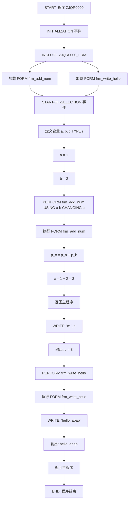
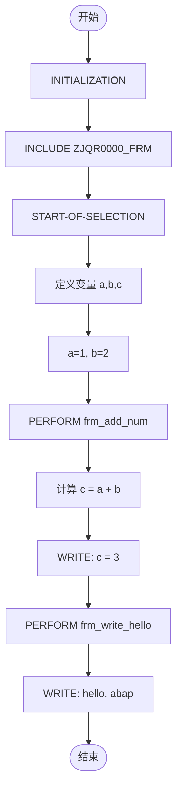

# ZJQR0000 程序源码分析与流程图

## 程序概述

| 项目 | 内容 |
|------|------|
| 程序名 | ZJQR0000 |
| 类型 | ABAP Report |
| 包含文件 | ZJQR0000_FRM |
| 功能 | 数字相加示例程序 |

---

## 源码清单

### 主程序 ZJQR0000

```abap
*&---------------------------------------------------------------------*
*& Report ZJQR0000
*&---------------------------------------------------------------------*
REPORT zjqr0000.

INITIALIZATION.
  INCLUDE zjqr0000_frm.

START-OF-SELECTION.

  DATA: a TYPE i.
  DATA: b TYPE i.
  DATA: c TYPE i.
  a = 1.
  b = 2.

  PERFORM frm_add_num USING a b CHANGING c.
  WRITE:/ 'c: ', c.

  PERFORM frm_write_hello.
```

### 包含文件 ZJQR0000_FRM

```abap
*&---------------------------------------------------------------------*
*& 包含               ZJQR0000_FRM
*&---------------------------------------------------------------------*

*& Form frm_add_num
FORM frm_add_num  USING    p_a
                           p_b
                  CHANGING p_c.

  p_c = p_a + p_b.

ENDFORM.

*& Form frm_write_hello
FORM frm_write_hello .
  WRITE:/ 'hello, abap'.
ENDFORM.
```

---

## 代码结构分析

### 程序结构图

```
ZJQR0000 (主程序)
│
├── INITIALIZATION 事件
│   └── INCLUDE ZJQR0000_FRM
│       ├── FORM frm_add_num (加法运算)
│       └── FORM frm_write_hello (输出问候)
│
└── START-OF-SELECTION 事件
    ├── 定义变量 a, b, c
    ├── a = 1, b = 2
    ├── PERFORM frm_add_num (调用加法)
    ├── WRITE c (输出结果)
    └── PERFORM frm_write_hello (调用问候)
```

### 变量说明

| 变量 | 类型 | 作用 | 值 |
|------|------|------|-----|
| a | i (整数) | 加数1 | 1 |
| b | i (整数) | 加数2 | 2 |
| c | i (整数) | 结果 | 3 |
| p_a | i (整数) | FORM 参数-加数1 | 1 |
| p_b | i (整数) | FORM 参数-加数2 | 2 |
| p_c | i (整数) | FORM 参数-结果 | 3 |

### 子程序说明

| FORM | 参数 | 功能 |
|------|------|------|
| frm_add_num | USING p_a, p_b / CHANGING p_c | 计算 p_a + p_b 并存入 p_c |
| frm_write_hello | 无 | 输出字符串 'hello, abap' |

---

## 流程图

### Mermaid 代码



### 流程图 (简化版)



---

## 执行顺序

1. **INITIALIZATION 阶段**
   - 程序启动
   - 加载包含文件 ZJQR0000_FRM
   - 定义两个 FORM: frm_add_num, frm_write_hello

2. **START-OF-SELECTION 阶段**
   - 定义三个整型变量: a, b, c
   - 赋值: a = 1, b = 2
   - 调用 frm_add_num(a=1, b=2, c=?)
   - 输出结果: c = 3
   - 调用 frm_write_hello
   - 输出: hello, abap

3. **程序结束**

---

## 运行结果

```
c:            3
hello, abap
```

---

## 技术要点

| 要点 | 说明 |
|------|------|
| INITIALIZATION | 程序初始化事件，在选择屏幕显示前执行 |
| START-OF-SELECTION | 选择屏幕处理后的主处理事件 |
| INCLUDE | 代码复用机制，将子程序放入独立文件 |
| PERFORM | 调用 FORM 子程序 |
| USING/CHANGING | FORM 参数传递方式: USING 传入, CHANGING 传出 |
