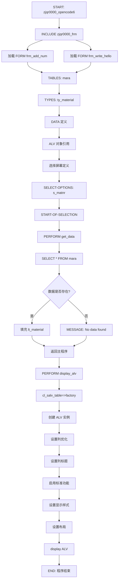
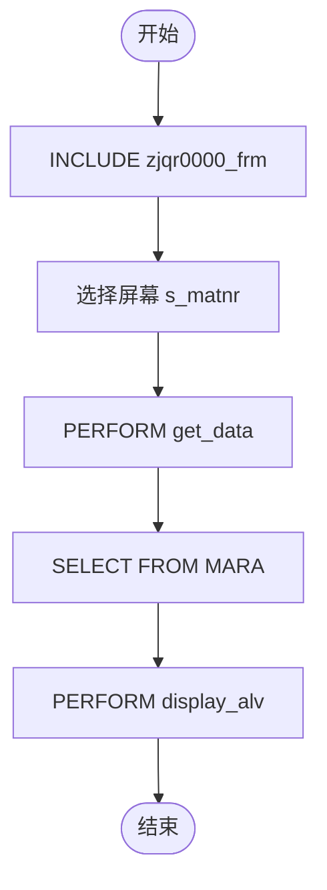

# zjqr0000_opencode6 程序源码分析与流程图

## 程序概述

| 项目 | 内容 |
|------|------|
| 程序 ID | zjqr0000_opencode6 |
| 程序名称 | Material Creation Report (CORRECTED) |
| 创建者 | OPENCODE |
| 创建日期 | 2026-03-22 |
| 描述 | 查询 MARA 物料创建信息 |
| 包含文件 | zjqr0000_frm |
| 消息类 | 00 |

---

## 源码清单

### 主程序 zjqr0000_opencode6

```abap
*&---------------------------------------------------------------------*
*& Program ID    : ZJQR0000_OPENCODE2
*& Program Name  : Material Creation Report (CORRECTED)
*& Created By   : OPENCODE
*& Created Date  : 2026-03-22
*& Description   : Query material creation info from MARA
*&                CORRECTED: Uses MARA-ERZET instead of CDHDR
*&---------------------------------------------------------------------*

REPORT zjqr0000_opencode6 MESSAGE-ID 00.

INCLUDE zjqr0000_frm.

*&---------------------------------------------------------------------*
*& Tables
*&---------------------------------------------------------------------*
TABLES: mara.

*&---------------------------------------------------------------------*
*& Types
*&---------------------------------------------------------------------*
TYPES:
  BEGIN OF ty_material,
    matnr TYPE mara-matnr,      " Material Number
    ersda TYPE dats,            " Creation Date
    erzet TYPE uzeit,           " Creation Time (MARA native field)
    ernam TYPE ernam,           " Creator Name
  END OF ty_material.

*&---------------------------------------------------------------------*
*& Data
*&---------------------------------------------------------------------*
DATA: lt_material TYPE TABLE OF ty_material.

DATA: lo_salv TYPE REF TO cl_salv_table,
      lo_cols TYPE REF TO cl_salv_columns_table,
      lo_col  TYPE REF TO cl_salv_column_table,
      lo_func TYPE REF TO cl_salv_functions_list,
      lo_display TYPE REF TO cl_salv_display_settings,
      lo_layout TYPE REF TO cl_salv_layout,
      lv_key TYPE salv_s_layout_key,
      lx_msg TYPE REF TO cx_salv_msg,
      lx_notfound TYPE REF TO cx_salv_not_found.

*&---------------------------------------------------------------------*
*& Selection Screen
*&---------------------------------------------------------------------*
SELECTION-SCREEN BEGIN OF BLOCK b1 WITH FRAME TITLE TEXT-001.

SELECT-OPTIONS:
  s_matnr FOR mara-matnr.    " Material Number Range

SELECTION-SCREEN END OF BLOCK b1.

*&---------------------------------------------------------------------*
*& Start of Selection
*&---------------------------------------------------------------------*
START-OF-SELECTION.
  PERFORM get_data.
  PERFORM display_alv.

*&---------------------------------------------------------------------*
*& Form GET_DATA
*&---------------------------------------------------------------------*
FORM get_data.
  SELECT *
    INTO CORRESPONDING FIELDS OF TABLE @lt_material
    FROM mara
    WHERE matnr IN @s_matnr
    ORDER BY matnr.

  IF lt_material IS INITIAL.
    MESSAGE 'No data found for the selected criteria' TYPE 'S' DISPLAY LIKE 'W'.
  ENDIF.
ENDFORM.

*&---------------------------------------------------------------------*
*& Form DISPLAY_ALV
*&---------------------------------------------------------------------*
FORM display_alv.
  TRY.
      cl_salv_table=>factory(
        IMPORTING r_salv_table = lo_salv
        CHANGING  t_table      = lt_material
      ).
    CATCH cx_salv_msg INTO lx_msg.
      MESSAGE lx_msg->get_text( ) TYPE 'E'.
  ENDTRY.

  lo_cols = lo_salv->get_columns( ).
  lo_cols->set_optimize( ).

  TRY.
      lo_col ?= lo_cols->get_column( 'MATNR' ).
      lo_col->set_long_text( 'Material Number' ).
      lo_col->set_medium_text( 'Material' ).
      lo_col->set_short_text( 'Mat' ).

      lo_col ?= lo_cols->get_column( 'ERSDA' ).
      lo_col->set_long_text( 'Creation Date' ).

      lo_col ?= lo_cols->get_column( 'ERZET' ).
      lo_col->set_long_text( 'Creation Time' ).

      lo_col ?= lo_cols->get_column( 'ERNAM' ).
      lo_col->set_long_text( 'Created By' ).

    CATCH cx_salv_not_found INTO lx_notfound.
      MESSAGE lx_notfound->get_text( ) TYPE 'W'.
  ENDTRY.

  lo_func = lo_salv->get_functions( ).
  lo_func->set_all( ).

  lo_display = lo_salv->get_display_settings( ).
  lo_display->set_striped_pattern( abap_true ).
  lo_display->set_list_header( 'Material Creation Report' ).

  lo_layout = lo_salv->get_layout( ).
  lv_key-report = sy-repid.
  lo_layout->set_key( lv_key ).
  lo_layout->set_default( abap_true ).

  lo_salv->display( ).
ENDFORM.
```

### 包含文件 zjqr0000_frm

```abap
*&---------------------------------------------------------------------*
*& 包含               ZJQR0000_FRM
*&---------------------------------------------------------------------*

*& Form frm_add_num
FORM frm_add_num  USING    p_a
                           p_b
                  CHANGING p_c.
  p_c = p_a + p_b.
ENDFORM.

*& Form frm_write_hello
FORM frm_write_hello .
  WRITE:/ 'hello, abap'.
ENDFORM.
```

---

## 代码结构分析

### 程序结构图

```
zjqr0000_opencode6
│
├── INCLUDE zjqr0000_frm (未被主程序调用)
│   ├── FORM frm_add_num
│   └── FORM frm_write_hello
│
├── 数据定义区
│   ├── TABLES: mara
│   ├── TYPES: ty_material (MATNR, ERSDA, ERZET, ERNAM)
│   ├── DATA: lt_material (内表)
│   └── DATA: ALV 对象引用
│
├── 选择屏幕
│   └── SELECT-OPTIONS: s_matnr (物料编号范围)
│
├── START-OF-SELECTION 事件
│   ├── PERFORM get_data (获取数据)
│   └── PERFORM display_alv (显示 ALV)
│
├── FORM get_data
│   └── SELECT FROM mara (查询物料主数据)
│
└── FORM display_alv
    ├── factory (创建 ALV 实例)
    ├── set_optimize (优化列宽)
    ├── set_long_text (设置列标题)
    ├── set_all (启用标准功能)
    ├── set_striped_pattern (设置斑马纹)
    ├── set_list_header (设置表头)
    └── display (显示 ALV)
```

### 数据结构

| 字段 | 类型 | 来源 | 说明 |
|------|------|------|------|
| MATNR | MARA-MATNR | MARA | 物料编号 |
| ERSDA | DATS | MARA | 创建日期 |
| ERZET | UZEIT | MARA | 创建时间 |
| ERNAM | ERNAM | MARA | 创建者 |

### 变量说明

| 变量 | 类型 | 作用 |
|------|------|------|
| lt_material | TABLE OF ty_material | 存储查询结果 |
| lo_salv | REF TO cl_salv_table | ALV 表格对象 |
| lo_cols | REF TO cl_salv_columns_table | ALV 列集合 |
| lo_col | REF TO cl_salv_column_table | ALV 单列对象 |
| lo_func | REF TO cl_salv_functions_list | ALV 功能列表 |
| lo_display | REF TO cl_salv_display_settings | 显示设置 |
| lo_layout | REF TO cl_salv_layout | 布局设置 |
| lv_key | salv_s_layout_key | 布局键值 |
| lx_msg | REF TO cx_salv_msg | ALV 消息异常 |
| lx_notfound | REF TO cx_salv_not_found | 列未找到异常 |

---

## 流程图

### Mermaid 代码



### 流程图 (简化版)



---

## 执行顺序

1. **INCLUDE 阶段**
   - 加载包含文件 zjqr0000_frm
   - 定义两个 FORM: frm_add_num, frm_write_hello
   - 注意: 这两个 FORM 未被主程序调用

2. **数据定义阶段**
   - 声明 TABLES: mara
   - 定义结构体类型 ty_material
   - 声明 ALV 相关对象引用

3. **选择屏幕阶段**
   - 显示物料编号范围选择

4. **START-OF-SELECTION 阶段**
   - 调用 get_data: 从 MARA 表查询数据
   - 调用 display_alv: 显示 ALV 报表

5. **get_data 子程序**
   - 执行 SELECT 查询 MARA 表
   - 检查是否有数据
   - 无数据时显示提示消息

6. **display_alv 子程序**
   - 创建 ALV 实例
   - 设置列标题和优化
   - 启用标准功能
   - 设置显示样式 (斑马纹、表头)
   - 显示 ALV 报表

7. **程序结束**

---

## 技术要点

| 要点 | 说明 |
|------|------|
| INCLUDE | 代码复用，但此程序未调用包含文件中的 FORM |
| CL_SALV_TABLE | 新版 ALV 报表类 |
| SELECT-OPTIONS | 选择屏幕范围选择 |
| TABLES 语句 | 声明数据库表引用 |
| TYPES BEGIN OF | 定义结构化数据类型 |
| REF TO | 对象引用声明 |
| TRY...CATCH | 异常处理机制 |
| CORRESPONDING FIELDS | 字段名匹配赋值 |

---

## 包含文件分析

包含文件 zjqr0000_frm 包含两个 FORM:

| FORM | 参数 | 功能 | 是否被调用 |
|------|------|------|------------|
| frm_add_num | USING p_a, p_b / CHANGING p_c | 计算两数之和 | ❌ 否 |
| frm_write_hello | 无 | 输出 'hello, abap' | ❌ 否 |

**注意**: 这两个 FORM 未被主程序调用，可能是遗留代码或备用功能。

---

## 修正说明

程序中包含以下修正 (CORRECTIONS):

1. **移除 CDHDR 关联** - MARA 本身有创建时间字段 ERZET
2. **修改数据类型** - 从 cdhdr-utime 改为 uzeit
3. **修正常量** - 从 c_on 改为 abap_true
4. **简化 SQL** - 无需 GROUP BY
5. **使用 MARA 原生字段** - ERSDA, ERZET, ERNAM
