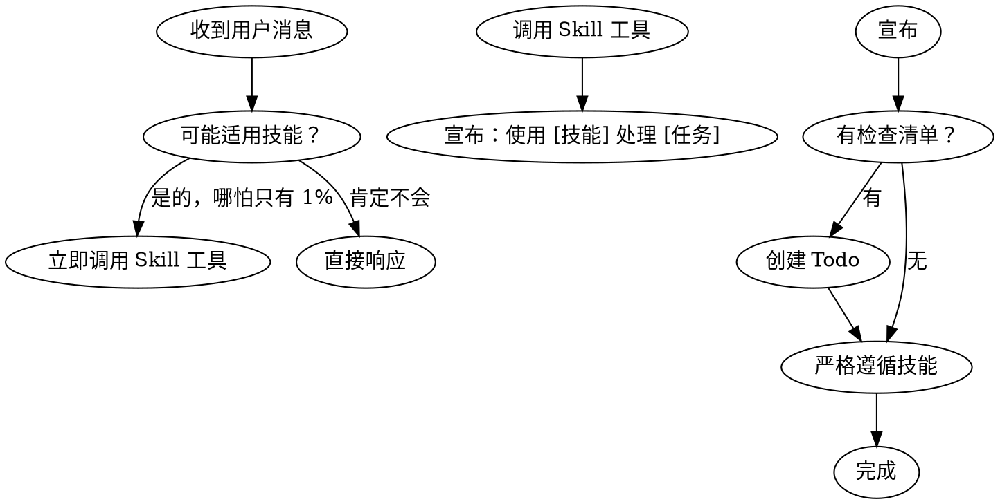

# Superpowers 技能包

> 元技能：如何高效使用 Skills

## 概述

Superpowers 技能包（29.9K 安装）是关于**如何使用技能**的元技能。它的核心理念是：

> **在执行任何任务前，先检查是否有相关的技能可以使用**

---

## 核心规则

```
┌─────────────────────────────────────────────────────────────┐
│                                                             │
│  收到用户消息                                               │
│       ↓                                                    │
│  检查是否有技能适用？（哪怕只有 1% 的可能性）                │
│       ↓                                                    │
│  有 → 立即加载并使用该技能                                   │
│       ↓                                                    │
│  执行技能指引                                               │
│                                                             │
└─────────────────────────────────────────────────────────────┘
```

---

## 规则优先级

| 优先级 | 来源 | 说明 |
|--------|------|------|
| **1** | 用户指令 | AGENTS.md / 直接请求（最高优先级） |
| **2** | Superpowers 技能 | 覆盖默认行为 |
| **3** | 系统默认 | 最低优先级 |

> 用户指令 > Superpowers > 系统默认

---

## 何时检查技能

### 必须检查的场景

| 场景 | 示例 | 是否检查 |
|------|------|----------|
| 简单问题 | "你好" | ❌ |
| 编程任务 | "帮我写个函数" | ✅ |
| 代码审查 | "review 代码" | ✅ |
| PDF 操作 | "处理 PDF" | ✅ |
| Git 操作 | "提交到 git" | ✅ |
| 天气查询 | "今天天气" | ✅ |

### "停止"信号（避免合理化）

| 错误想法 | 实际情况 |
|----------|----------|
| "这只是简单问题" | 问题也是任务，检查技能 |
| "我需要先了解更多" | 先检查技能，再提问 |
| "我可以直接查看文件" | 技能告诉如何查看 |
| "这不需要正式技能" | 如果存在技能就用它 |

---

## 技能类型

### 1. 流程技能（Process Skills）
- 如：brainstorming, debugging
- **先执行**：决定如何处理任务

### 2. 实现技能（Implementation Skills）
- 如：frontend-design, mcp-builder
- **后执行**：指导具体实现

### 使用顺序

```
"构建 X"     → 先 brainstorming → 再实现技能
"修复 bug"   → 先 debugging → 再领域技能
```

---

## 指令类型

### Rigid（严格型）
- 如：TDD, debugging
- **必须严格遵循**，不能随意调整

### Flexible（灵活型）
- 如：patterns
- 根据上下文**调整原则**

> 查看具体 SKILL.md 确定是哪种类型

---

## 技能检查流程图



---

## 常见问题

### Q1: 技能不适用怎么办？

如果调用的技能最终不适用，直接跳过即可，不需要强制使用。

### Q2: 多个技能都适用？

按以下顺序：
1. 流程技能优先（brainstorming → debugging）
2. 实现技能其次

### Q3: 如何知道技能的类型？

查看 SKILL.md 中的类型说明：
- 严格型会明确说明 "Follow exactly"
- 灵活型会说明 "Adapt to context"

---

## Superpowers 工作流

```
Step 1: 接收用户请求
Step 2: 立即检查是否有适用技能
Step 3: 有技能 → 加载并遵循
Step 4: 无技能 → 直接响应
Step 5: 完成
```

---

## 安装信息

| 项目 | 值 |
|------|-----|
| 名称 | superpowers (using-superpowers) |
| 来源 | obra/superpowers |
| 安装次数 | 29.9K |
| 类型 | 元技能（关于如何使用技能） |
| 安装位置 | ~/.agents/skills/using-superpowers |

---

## 相关技能

| 技能 | 用途 |
|------|------|
| **find-skills** | 查找和安装技能 |
| **skill-creator** | 创建新技能 |
| **auto-doc-git** | 自动文档和 Git 提交 |

---

## 总结

```
Superpowers 的核心价值：

1. 永远不要假设"不需要技能"
2. 先检查技能，再执行任务
3. 技能决定工作方式，而非临时发挥
4. 保持纪律性，避免随意行动
```

---

*更多信息: https://skills.sh/obra/superpowers/using-superpowers*
